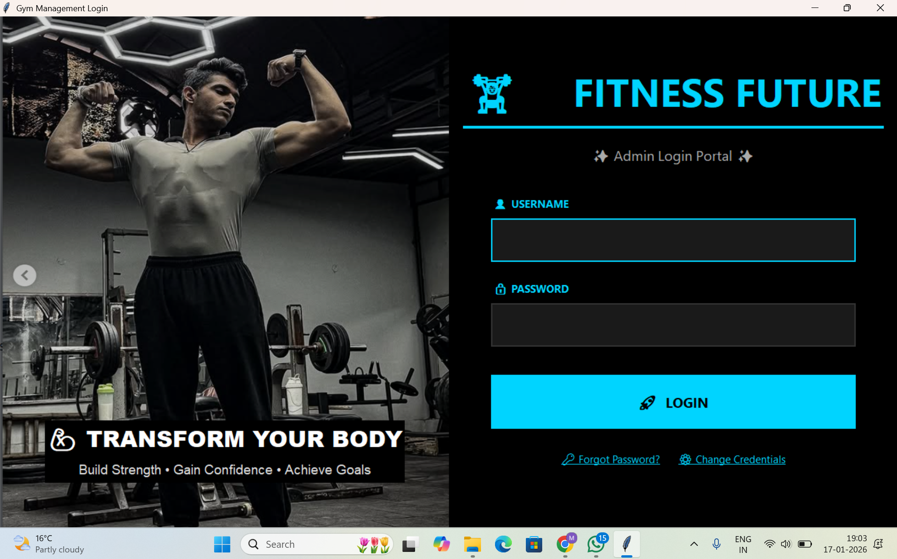
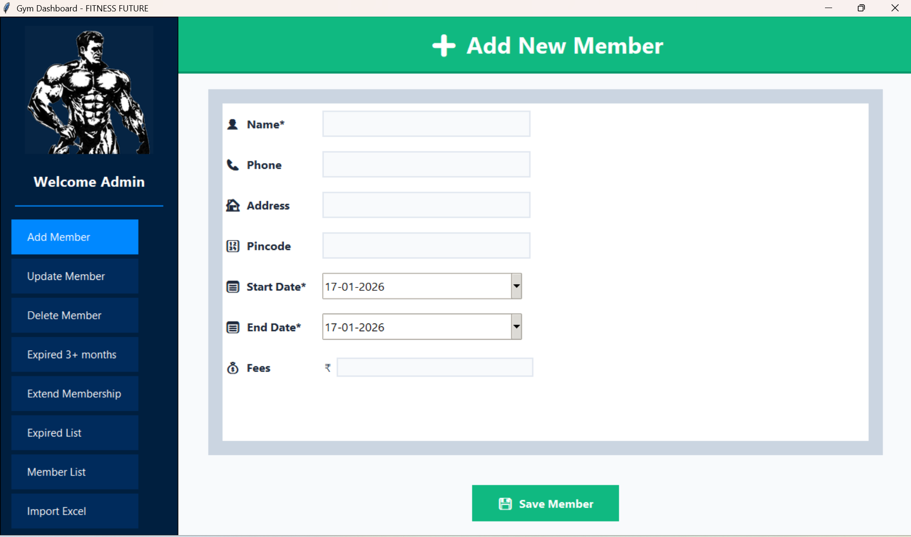
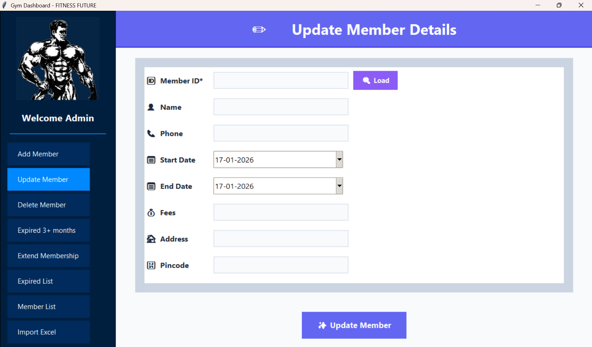
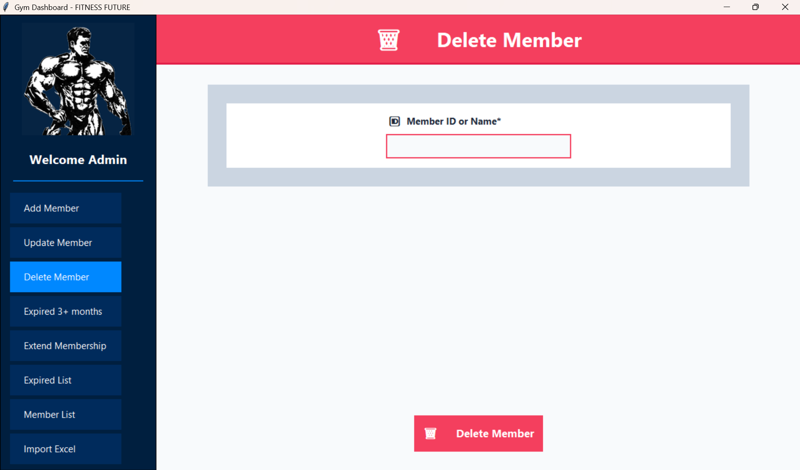
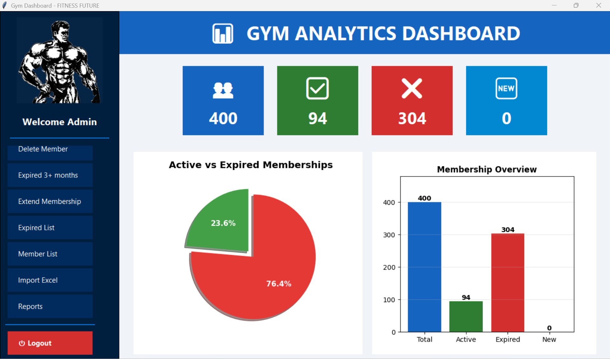
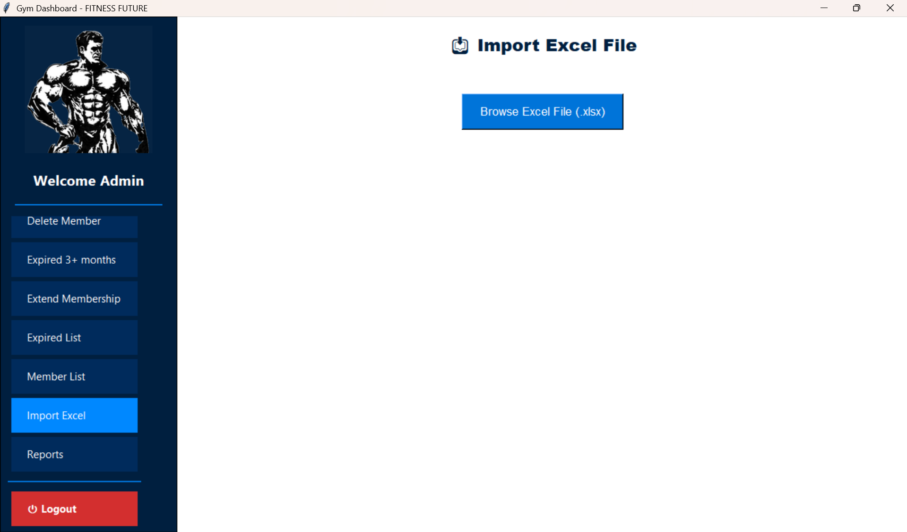
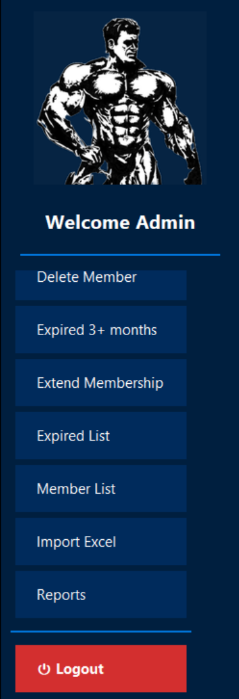

# 🏋️ Fitness Future - Professional Gym Management System

<div align="center">


**A production-ready desktop application for gym membership management**

[Features](#-features) • [Demo](#-screenshots) • [Installation](#-quick-start) • [Tech Stack](#-technologies--skills-demonstrated)

</div>

---

## 🎯 Project Overview

A comprehensive desktop solution designed to streamline gym operations, reduce administrative overhead, and enhance member experience. Built with scalability and user experience in mind, this system handles member lifecycle management, automated notifications, and data analytics - demonstrating full-stack development capabilities and business process understanding.

### 🎖️ Key Achievements
- 🚀 **Production-Ready**: Fully functional with executable deployment
- 📊 **Data Management**: Handles bulk operations with 1000+ member records
- 🔄 **Real-time Processing**: Instant search and filtering capabilities
- 🛡️ **Secure**: Password-protected with credential management
- 📈 **Scalable Architecture**: Thread-safe database operations with WAL mode

## ✨ Features

### 👥 Member Management
- **CRUD Operations**: Full create, read, update, delete functionality
- **Advanced Search**: Real-time search across all member fields
- **Data Validation**: Input validation with error handling
- **Bulk Operations**: Import/update hundreds of records simultaneously

### 📅 Membership Tracking
- **Automated Monitoring**: Track membership start/end dates automatically
- **Expiry Detection**: Instant identification of expired memberships
- **One-Click Extensions**: Streamlined renewal process
- **Custom Date Ranges**: Flexible membership period configuration

### 📊 Data Operations
- **Excel Integration**: Drag-and-drop Excel import with data mapping
- **Bulk Import**: Process large datasets efficiently
- **Export Functionality**: Generate Excel reports with filtered data
- **Data Integrity**: Transaction-based operations ensuring consistency

### 🎨 User Experience
- **Modern UI/UX**: Clean, professional interface design
- **Responsive Layout**: Adapts to different screen sizes
- **Intuitive Navigation**: Easy-to-use menu system
- **Visual Feedback**: Loading indicators and success/error messages

### 🔐 Security & Authentication
- **Login System**: Secure password-protected access
- **Credential Management**: Encrypted credential storage
- **Session Handling**: Proper authentication flow
- **Password Reset**: Built-in password recovery

### 📈 Business Intelligence
- **Report Generation**: Comprehensive membership analytics
- **Expiry Tracking**: Proactive member retention insights
- **Data Export**: Export for further analysis
- **Performance Metrics**: Track gym growth and trends

## 🚀 Technologies & Skills Demonstrated

### Core Technologies
| Technology | Purpose | Proficiency |
|------------|---------|-------------|
| **Python 3.8+** | Core development language | Advanced |
| **Tkinter/TkinterDnD2** | Desktop GUI framework | Advanced |
| **SQLite** | Relational database | Intermediate |
| **Pandas** | Data analysis & manipulation | Intermediate |
| **Pillow (PIL)** | Image processing | Intermediate |
| **OpenPyXL** | Excel integration | Intermediate |
| **� Screenshots

<div align="center">

### 🔐 Login Screen
*Professional authentication interface with secure access control*



---

### ➕ Add Member
*Intuitive form for adding new gym members with complete details*



---

### ✏️ Update Member
*Easy member information editing and modification*



---

### 🗑️ Delete Member
*Safe member removal with confirmation*



---

### 📊 Reports & Analytics
*Comprehensive reporting system with data insights*



---

### 📥 Excel Import
*Bulk data import with drag-and-drop functionality*



---

### 🎯 Additional Features
*Extended functionality for complete gym management*



</div>

---

## 🚀 Quick Start

### Prerequisites
- Python 3.8 or higher
- pip (Python package installer)
- Git (for cloning)

### Installation

1. **Clone the repository**
   ```bash
   git clone https://github.com/palmanisha729-web/fitness-future-gym.git
   cd fitness-future-gym
   `� Project Architecture

```
fitness-future-gym/
├── 📄 main.py                     # Application entry point
│
├── 💾 database/                   # Data layer
│   ├── db_connect.py              # Connection pooling & management
│   ├── member_ops.py              # CRUD operations
│   └── credentials.py             # Authentication logic
│
├── 🎨 gui/                        # Presentation layer
│   ├── login.py                   # Authentication UI
│   ├── dashboard.py               # Main navigation hub
│   ├── add_member.py              # Member creation form
│   ├── update_member.py           # Member update form
│   ├── delete_member.py           # Member deletion interface
│   ├── member_list.py             # Member browser with search
│   ├── expired_membership_page.py # Expiry management
│   ├── extend_membership.py       # Renewal interface
│   ├── drag_drop_import.py        # Bulk import wizard
│   └── report.py                  # Report generator
│
├── 🛠️ utils/                      # Helper modules
│   └── path_utils.py              # Resource path resolution
│
├── � Key Technical Implementations

### Database Optimization
```python
# Thread-safe connection management with performance optimization
conn.execute('PRAGMA journal_mode=WAL')      # Write-Ahead Logging
conn.execute('PRAGMA synchronous=NORMAL')    # Balanced performance
conn.execute('PRAGMA cache_size=10000')      # Enhanced caching
```

### Excel Import Pipeline
- Data validation and sanitization
- Duplicate detection
- Error handling with user feedback
- Batch processing for large files

### UI Responsiveness
- Asynchronous operations for heavy tasks
- Progress indicators for long-running operations
- Debounced search for real-time filtering

---

## 💻 Usage Guide

### Member Operations
1. **Add Member**: Dashboard → Add Member → Fill form → Save
2. **Update Member**: Member List → Select → Edit → Update
3. **Delete Member**: Member List → Select → Delete → Confirm
4. **Search**: Real-time search across all fields

### Bulk Import
1. Prepare Excel with columns: `Name`, `Phone`, `Start Date`, `End Date`, `Fees`, `Address`, `Pincode`
2. Drag & drop file into import area
3. Review data mapping
4. Confirm import

### Reports & Analytics
1. Navigate to Reports
2. Select filters (date range, status)
3. Generate report
4. E� Deployment

### Building Standalone Executable

```bash
# Install PyInstaller
pip install pyinstaller

# Build executable
pyinstaller build_exe.spec

# Output location
dist/Fitness Future Gym/
```

### Cross-Platform Compatibility
- ✅ Windows 10/11
- ✅ macOS 10.14+
- ✅ Linux (Ubuntu 20.04+)

---

## 🎓 Learning Outcomes

This�‍💻 About the Developer

**Manisha** - Full Stack Python Developer

I'm passionate about creating practical software solutions that solve real-world problems. This project showcases my ability to design, develop, and deploy production-ready applications.

### 🔗 Connect With Me
[](https://github.com/palmanisha729-web)
[](https://linkedin.com/in/manisha-pal)
[](https://github.com/palmanisha729-web)

### 💼 Open to Opportunities
I'm actively seeking opportunities in:
- Python Development
- Desktop Application Development
- Full Stack Development
- Software Engineering Roles

---

## 🤝 Contributing

Contributions, issues, and feature requests are welcome!

1. Fork the repository
2. Create your feature branch (`git checkout -b feature/AmazingFeature`)
3. Commit changes (`git commit -m 'Add: AmazingFeature'`)
4. Push to branch (`git push origin feature/AmazingFeature`)
5. Open a Pull Request

See [CONTRIBUTING.md](CONTRIBUTING.md) for detailed guidelines.

---

## 📄 License

This project is licensed under the MIT License - see the [LICENSE](LICENSE) file for details.

---

## 🙏 Acknowledgments

- Built with dedication to solve real gym management challenges
- Thanks to the Python community for excellent libraries and documentation
- Inspired by modern desktop application design principles

---

## 📞 Support & Feedback

- 📧 **Questions?** Open an [issue](https://github.com/palmanisha729-web/fitness-future-gym/issues)
- 💬 **Feedback?** I'd love to hear from you!
- ⭐ **Like this project?** Give it a star!

---

<div align="center">

**Made with ❤️ by Manisha**

⭐ Star this repo if you find it useful!

[⬆ Back to Top](#-fitness-future---professional-gym-management-system)

</div>
- [ ] Workout plan management
- [ ] Revenue analytics dashboard
- [ ] Multi-branch supportess
- 🔄 **Batch Operations**: Process 1000+ records efficiently
- 📊 **Memory Management**: Lazy loading for large datasets

### Code Quality
- ✅ **Error Handling**: Comprehensive try-catch blocks
- 📝 **Documentation**: Inline comments and docstrings
- 🧹 **Clean Code**: PEP 8 compliant
- 🔒 **Security**: Input validation and SQL injection prevention
   ```bash
   python main.py
   ```

## 🔧 Project Structure

```
fitness-future-gym/
├── main.py                 # Application entry point
├── database/              
│   ├── db_connect.py      # Database connection management
│   ├── member_ops.py      # Member operations
│   └── credentials.py     # User authentication
├── gui/                   
│   ├── login.py           # Login screen
│   ├── dashboard.py       # Main dashboard
│   ├── add_member.py      # Add member interface
│   ├── update_member.py   # Update member interface
│   ├── delete_member.py   # Delete member interface
│   ├── member_list.py     # Member list view
│   ├── expired_membership_page.py
│   ├── extend_membership.py
│   ├── drag_drop_import.py # Excel import
│   └── report.py          # Report generation
├── utils/                 
│   └── path_utils.py      # Path utilities
├── assets/                # Images and resources
└── requirements.txt       # Python dependencies
```

## 💻 Usage

### Default Login Credentials
- **Username**: `admin`
- **Password**: `admin123`

**Important**: Change the default credentials after first login for security.

### Adding Members
1. Click "Add Member" from the dashboard
2. Fill in member details (name, phone, address, membership dates)
3. Click "Save" to add the member to the database

### Importing Members from Excel
1. Prepare an Excel file with columns: Name, Phone, Start Date, End Date, Fees, Address, Pincode
2. Use the drag-and-drop import feature
3. Review imported data before confirming

### Viewing Reports
1. Navigate to the Reports section
2. Select date range and filters
3. Export to Excel for further analysis

## 🔐 Database

The application uses SQLite for data storage. The database is automatically created on first run and includes:
- Members table (stores all member information)
- Credentials table (stores login information)

## 🛠️ Building Executable

To create a standalone executable:

```bash
pyinstaller build_exe.spec
```

The executable will be available in the `dist/` folder.

## 🤝 Contributing

Contributions are welcome! Please feel free to submit a Pull Request.

1. Fork the repository
2. Create your feature branch (`git checkout -b feature/AmazingFeature`)
3. Commit your changes (`git commit -m 'Add some AmazingFeature'`)
4. Push to the branch (`git push origin feature/AmazingFeature`)
5. Open a Pull Request

## 📝 License

This project is licensed under the MIT License - see the [LICENSE](LICENSE) file for details.

## 👤 Author

**Manisha**

- GitHub: [@yourusername](https://github.com/yourusername)
- LinkedIn: [Your LinkedIn Profile](https://linkedin.com/in/yourprofile)

## 🙏 Acknowledgments

- Thanks to all contributors who have helped improve this project
- Inspired by the need for simple, effective gym management solutions

## 📧 Contact

For questions or support, please open an issue on GitHub or contact me through LinkedIn.

---

⭐ If you find this project useful, please consider giving it a star!
